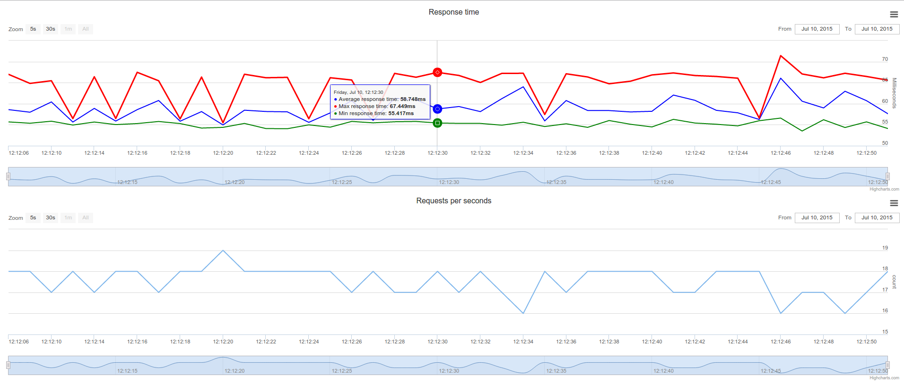

# ab-go 

Inspired by `apache ab testing tool`. Created with `golang`. Add few features.

You can use:

- File with post data strings
- File with urls strings
- Headers file
- Realtime stats
- Send result to Slack

run ./ab-go for usage

## run options:

##### -n
Number of requests sended to server.

##### -c
Number of concurrency requests sended in one batch.

##### -d
String with post data

##### -p
String with filename contains post data strings

##### -u
String with filename contains urls strings

##### -H
String with header

##### -h
String with filename contains headers strings

##### -t
Number of milliseconds request timeout

##### -test
Testing mode. Enable cycled tests with send results to graphics.
Run with this flag and open `localhost:9999` (default port) in your browser

Data is updated every second.

##### -port
Embedded web-server port. Used with `-test` flag

##### -slack
String with Slack endpoint url for sending results.

##### -name
String of tested api name, who will be presented in results message in Slask. Used with `-slack` flag

-----------------
#### build:
mkdir $GOPATH/src/github.com/andboson/ab-go && cd $GOPATH/src/github.com/andboson/ab-go

git clone git@github.com:andboson/ab-go.git .

make
